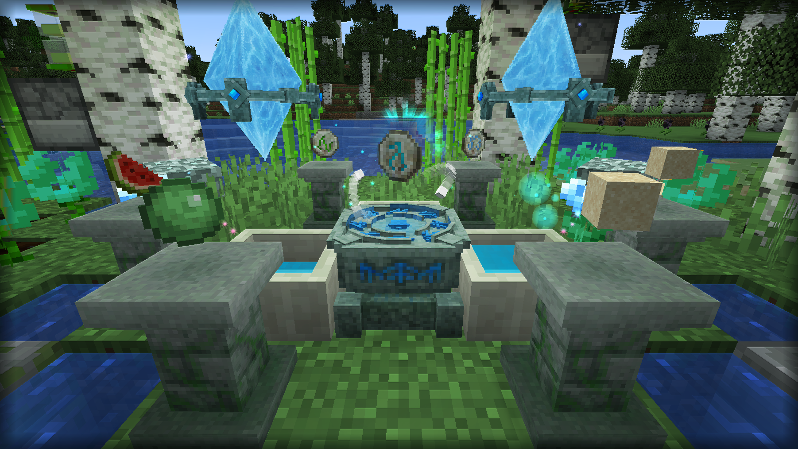
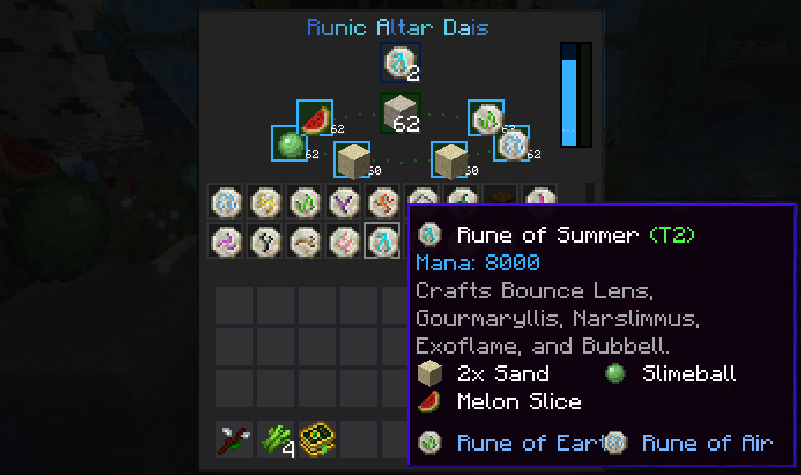
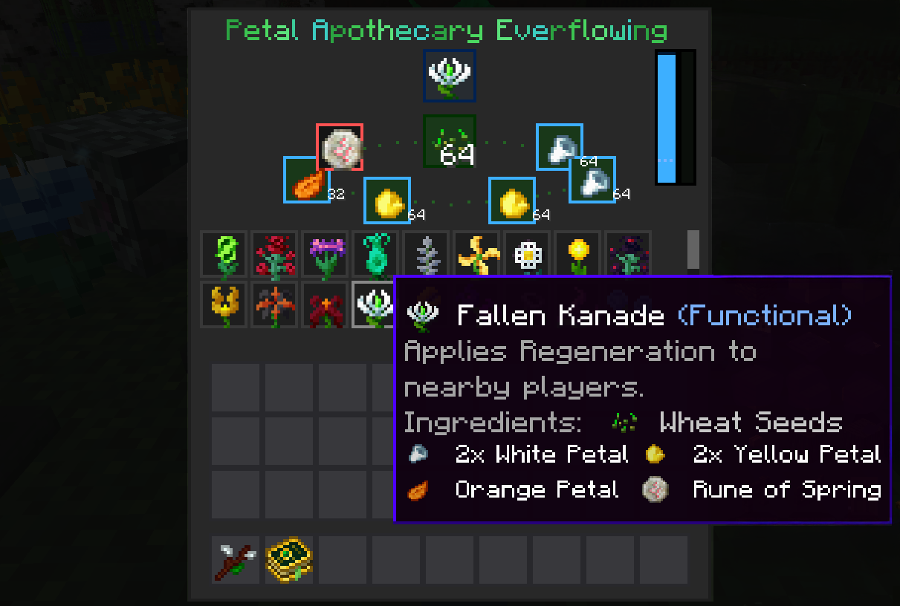
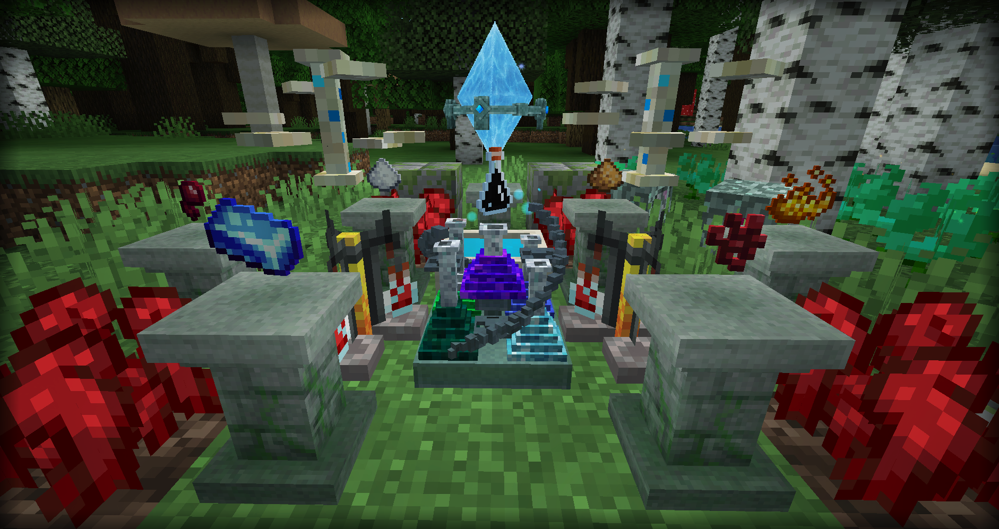
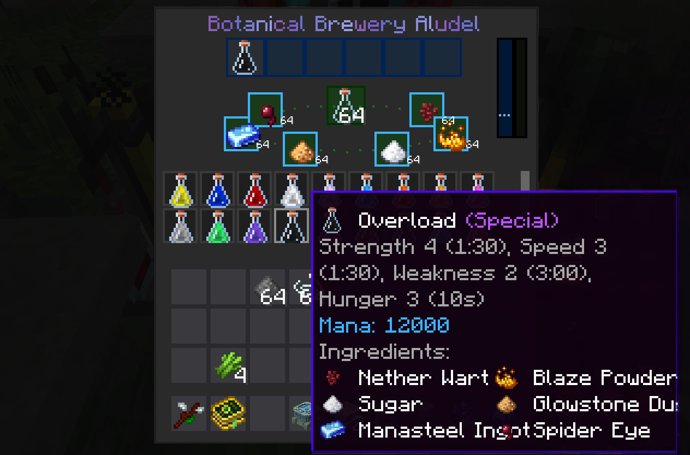
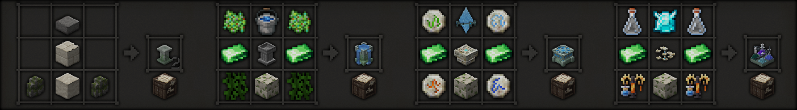

# Botania Runic Ritualization

a Minecraft [Botania](https://github.com/VazkiiMods/Botania) addon with batch crafting of runes , flowers , and brews .  drawing ingredients from nearby pedestals . 

- Available for Minecraft 1.20.1 with Fabric

|  |  |  |  |
| :---: | :---: | :---: | :---: |

## Runic Altar Dais
craft runes atop the altar dais , surrounded by pedestals of living rock , consuming increased mana .

## Petal Apothecary Everflowing
the everflowing apothecary empowered by mana draws forth reagents from the pedestals crafting flowers over time .

## Botanical Brewery Aludel
an aludel brews batches bubbling with mana mixing from the surrounding pedestals .

 
## CRAFT

- pedestal = smooth stone slab , 2x living rock brick , 2x mossy stone wall 
- apothecary everflowing = 2x terrasteel , 2x floral fertilizer , 2x vines , water bucket , mossy living rock brick , petal apothecary
- runic dais = 2x terrasteel , 4 elemental runes - earth air water fire , mana pylon , mossy living rock brick , runic altar
- aludel = 2x terrasteel , 2 of any brewed vial , mana diamond , botanical brewery , mossy living rock brick , 2x brewing stand 

---
# THANKS
- Major thanks to [Vazkii](https://github.com/Vazkii) for creating [Botania](https://github.com/VazkiiMods/Botania)

# LICENSE
free to all , free to modify , [creative commons zero CC0 1.0](https://creativecommons.org/publicdomain/zero/1.0/) , free to re-distribute , attribution not needed . feel free to integrate and modify into your own projects , mods , and texture packs
